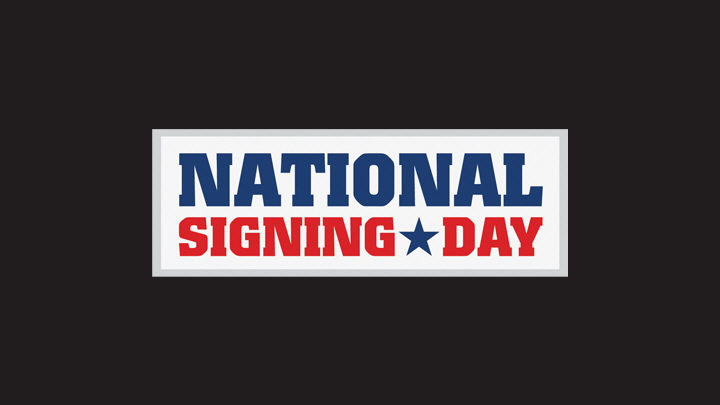
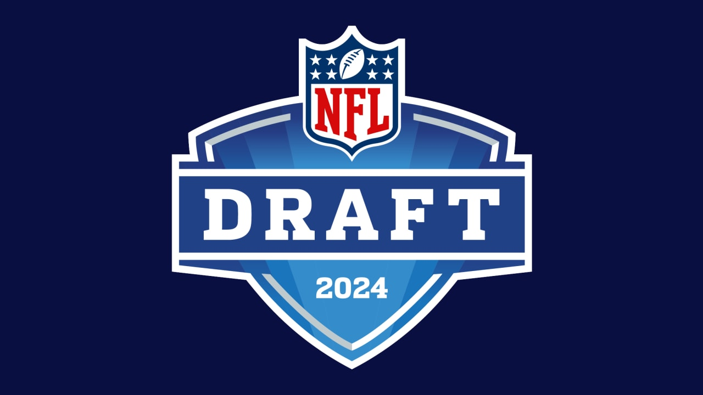

# BlueChip to NFL Draft:

*A data analysis project designed to measure the relationship between the player rating received as a highschool football player and the rating received when entering the NFL Draft. I took Highschool football recruiting data from 2015 to 2023 and compared it with NFL Draft player rating data.

()
()

## Questions:

1. How accurate are the High School Scouts ratings when compared to NFL Scouts?

2. Are there any trends with the outliers?

3. Do any conferences produce better ratings? 

## The Data:

The data used in this project can be found here: [Datasource](https://collegefootballdata.com/exporter)

This data was downloaded by year and then combined. This was done for Recruiting Ranking and NFL Draft data.

## How to Run:

The project was created using Jupyter Notebook with a virtual environment in Visual Studio. The main project file '''Capstone.ipynb'''  and will contain all the code. There is a '''requirements.txt''' included in this repository to install all the packages needed to run this project on your own machine exactly as I have done.

## Visualizations:

I used tableau Public for my visualizations in order for the end-user to be able to interact with data. 

# Key Findings:

